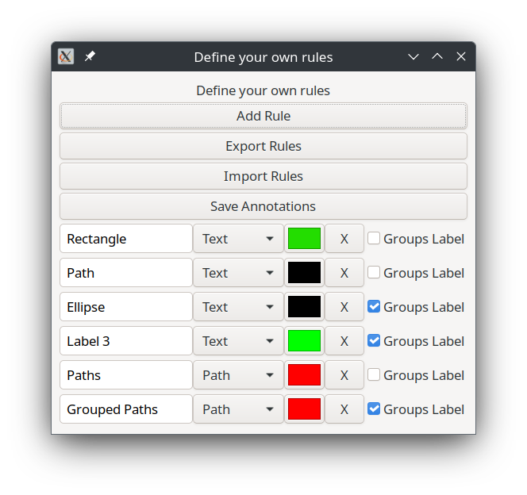

# Laudare Annotator

This is an Inkscape plugin for annotating images for Computer Vision tasks.

<p align="center">
    
</p>

It has been developed in the context of the Laudare ERC project for annotating ancient
characters to build font in a document augmentation approach. However, I have built it
with general-purpose annotation tasks in mind, so it is likely useful for other projects
as well.

The plugin stores the bounding boxes of each shape in a JSON file, connecting each
object to a label according to customizable rules.

## Features

1. Automatic color palette detection, detecting similar colors as a single label
2. Exporting and importing rules (each rule connect a combination of shape-color to a
   label)
3. Ability to assign labels to group of objects and to remember objects labeled inside
   the groups
4. Export to JSON format, easy for parsing in other projects
5. Embed the image in base64 format
6. Supports text, rectangles, paths, and ellipses, but only the bounding boxes and the
   text content are remembered
7. Remember last used rules
8. Consistent with visible annotations (hidden, transparent, empty shapes/texts are
   skipped)
9. Further command to compute statistics about the annotations ("Extensions" > "Laudare
   Extension Counts")

## How to use

**N.B. Due to a [bug in Inkscape 1.3](https://gitlab.com/inkscape/inbox/-/issues/9143), it is recommended the use of Inkscape <1.3** 

1. Download the Zip file and extract it into the directory listed at `Edit` >
   `Preferences` > `System: User extensions`. After a restart of Inkscape, the new
   extension will be available.
2. Define a color palette with a little number of colors
3. Use shaes and text to annotate images
4. Use `File` > `Save As` and look for "Laudare JSON" format
5. Press `Save` and choose the file name
6. In the GUI that shows up, define your own rules. You can export them to reload them
   later. The last used rules will be remembered without needing to save them
7. Press `Export Annotations` and wait

If a window shows up saying that "Inkscape has received additional data" but that "there
was no error", that is ok.

## JSON format

This an example of JSON file created by the plugin:

```python
{
    "info": {
        "author": "sapo",
        "date": "2023-06-30T15:04:02.644951",
        "image": {
             # base64 encoding or the link to the image if you link it in inkscape
             # instead of embedding it
            "href": "data:image/png;base64,xxxxxxxxxxxxxxxxxxxxxxxxxxxxxxxxxxxxxxxxxxxxxxxx"
            # position of the image in the viewport: x, y, h, w
            "position": (54.490620000000035, 87.261764, 499.72580000000005, 651.9024)
        },
         # unit used for the dimensions, here for reference, but it is and will always
         # be in "px", meaning "pixel"
        "unit": "px"
    },
    "annotations": {
        "Label 0": {
            "shape": "Text", # the matched type of shape, one of Text, Path, Rectangle, Ellipse
            "color": "rgb(0,0,0)", # this is always in "rgb(x, y, z)" format
            "elements": {}, # this will be filled with elements tagged with "Label 0"
            "groups": {  # map of groups
                "g1017": {
                     # the list of elements in the group
                    "children": ["text3737", "text3741"],
                     # the text included if this was a Text, but it"s a group...
                    "text": None,
                     # bounding box of this group with reference to the image, not to
                     # the viewport: 0, 0, h, w  means the top-left corner is in the
                     # top-left corner of the image!
                    "x": 138.93092371469996,
                    "y": 191.55871048500003,
                    "h": 12.366090832999987,
                    "w": 9.363188497400017,
                },
                "g4177": {
                    "children": ["text3773", "text3777"],
                    "h": 13.506762920920039,
                    "text": None,
                    "w": 10.093336167100006,
                    "x": 108.17317431249995,
                    "y": 191.12298972147997},
                    "shape": "Text"
                }
            }
        "Label 1": {
            "color": "rgb(0,0,0)",
            "shape": "Text",
            "elements": {
                 # this is one of the children listed in the above groups!
                "text3737": {
                     # the text in this element, in this case, it"s actually only one letter!
                    "text": "m",
                    "children": [],
                    "h": 20.452499514192425,
                    "w": 20.89529950367458,
                    "x": 189.1733742122565,
                    "y": 173.6172298033492
                },
                "text3741": {
                    "children": [],
                    "h": 20.82709950529454,
                    "text": "e",
                    "w": 12.444799704399031,
                    "x": 251.74837272591446,
                    "y": 175.12722976748225
                },
                "text3773": {
                    "children": [],
                    "h": 24.32199942228027,
                    "text": "l",
                    "w": 5.318169873677675,
                    "x": 144.06737528365792,
                    "y": 167.23722995489314
                },
                "text3777": {
                    "children": [],
                    "h": 25.05989940475297,
                    "text": "t",
                    "w": 8.776559791530644,
                    "x": 230.9413732201425,
                    "y": 169.89122989185276
                }
            }  # closing "elements"
        }  # Closing "Label 1"
    }  # Closing "Annotations"
}  # Closing root
```

## TODO

1. Importing annotations into Inkscape for visualizing them is possible and easy
2. The plugin performs check of formal correctness of the annotations, but that part can
   largely be improved
3. Provide some good general-purpose color palette and tweak the Inkscape UI in order to
   decrease the probability of errors (this would become a full Inkscape config folder)
4. Add ability for automatic detection of shapes inside the bounding boxes
5. Right now, stroke and fill colors are checked in an "or" fashion: shapes with different
   color in shape and fill will be labeled in an unpredictable way

## Credits

Federico Simonetta, federico.simonetta [at] gssi.it, https://federicosimonetta.eu.org
